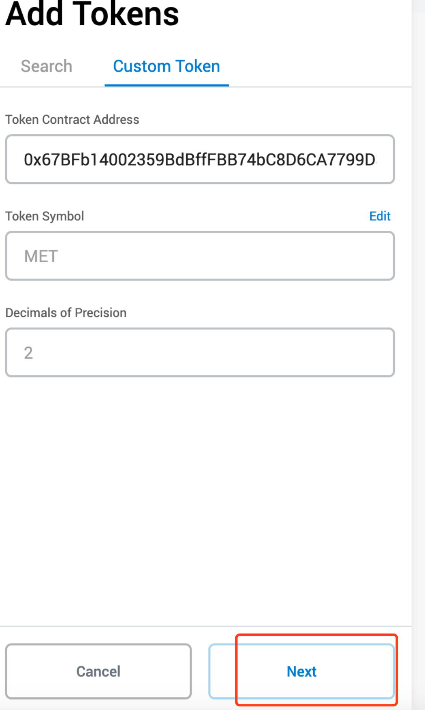
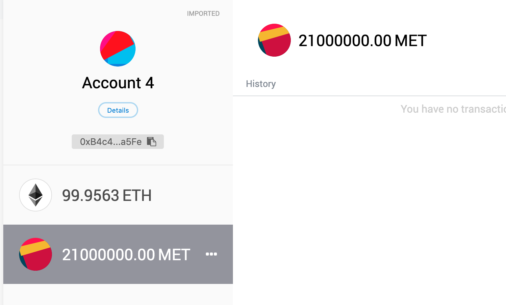

#### 0 环境准备
- Truffle v5.1.18 (core: 5.1.18)
- Solidity v0.5.16 (solc-js)
- Node v12.12.0
- Web3.js v1.2.1
- Ganache CLI v6.4.2 (ganache-core: 2.5.4)
#### 1 继承openzeppelin标准代币合约
```
npm install openzeppelin-solidity
```
> 注意：本project 没有上传node_modules
#### 2 编译&部署
记录contractaddress
#### 3 metamask加入token
![erc20-1](../imgs/erc20-1.png

