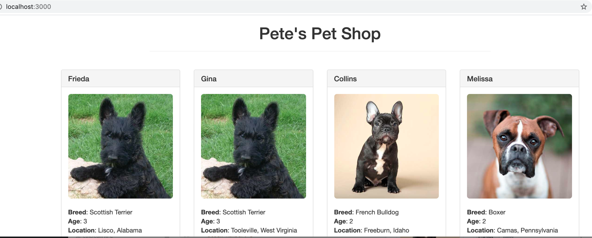
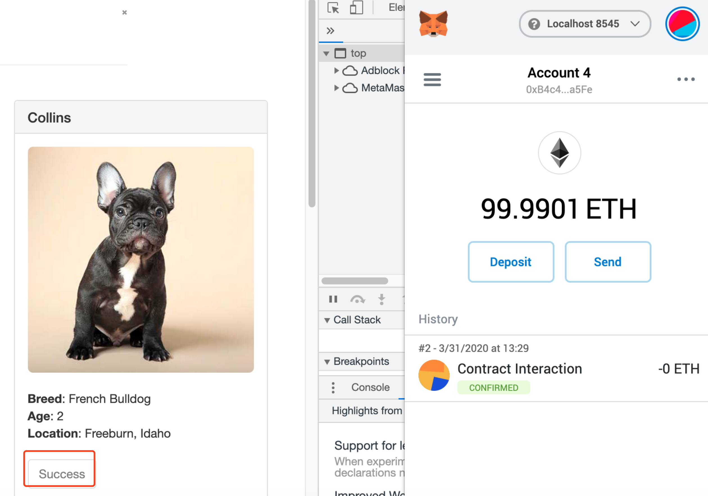

#### 0 环境准备
- Truffle v5.1.18 (core: 5.1.18)
- Solidity v0.5.16 (solc-js)
- Node v12.12.0
- Web3.js v1.2.1
- Ganache CLI v6.4.2 (ganache-core: 2.5.4)
- lite-server
#### 1 下载官方示例pet shop
```bash
truffle unbox pet-shop
```
https://www.trufflesuite.com/tutorials/pet-shop  
根据文档完成合约编写和js交互部分。
#### 2 使用metamask进行页面交易
#### 3 执行顺序
3.1 启动ganache-cli，copy一个私钥，在metamask导入；  
3.2 使用lite-server作为测试用的node服务器；
```
npm install lite-server --save-dev
```
目录下启动
```
npm run dev
```
一切正常首页

3.3 点击adopt  
弹出metamask窗口，点击确认，购买成功

3.4 查看ganache日志
```
  Transaction: 0x17620a51fe62ea0940344d93651afb232c44a2442c84e311676283fe66c1d689
  Gas usage: 42141
  Block Number: 3
```

#### 小结
旨在通过一个官方的demo，完成一个完整的dapp开发和部署，使用Web3与合约进行交互，使用metamask完成交易。