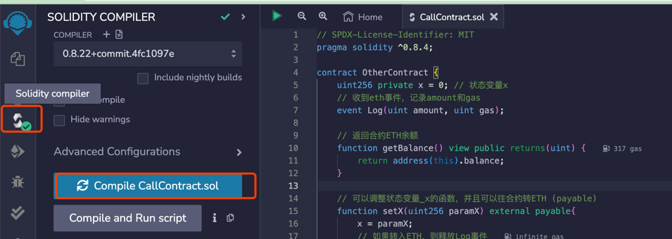
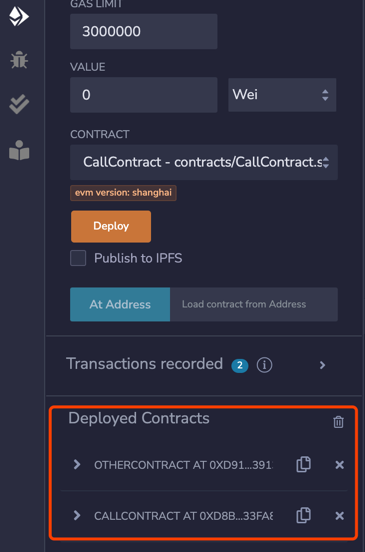
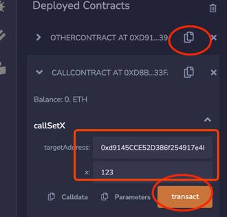
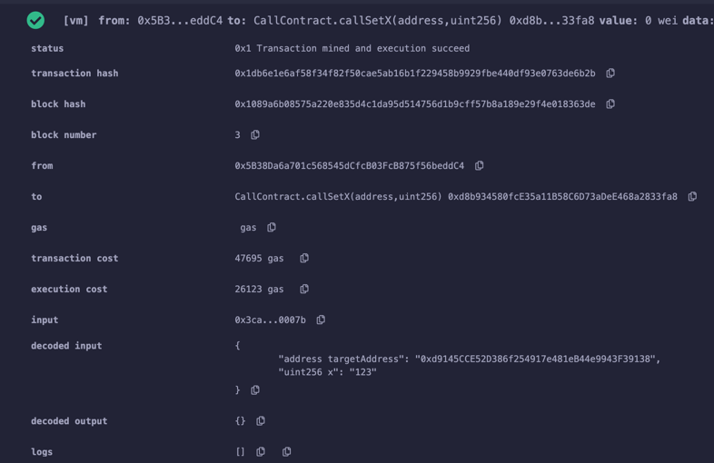
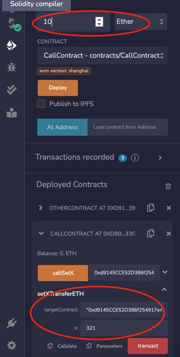
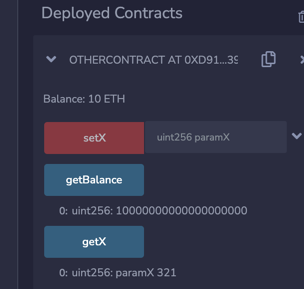

# 调用其他合约

调用已部署合约，类似于java编程中调用其他类提供的方法，
这样可以充分利用别的合约完成更复杂的业务的逻辑。体现在以太坊上，
就是复用合约，繁荣生态。很多web3项目依赖于调用其他合约，比如收益农场（yield farming）。
本文我们介绍如何在已知合约代码（或接口）和地址情况下调用目标合约的函数。

## 1 准备一个待调用合约

这个合约包含一个状态变量x，一个事件Log，在收到ETH时触发，三个函数：

- getBalance(): 返回合约ETH余额；
- setX(): external payable函数，可以设置x的值，并向合约发送ETH；
- getX(): 读取_x的值；

## 2 准备一个合约

类似java，拿到待调用合约的引用，通过引用调用该合约的方法，比如下面调用setX方法。

```solidity
    function callSetX(address targetAddress, uint256 x) external {
    OtherContract(targetAddress).setX(x);
}
```

## 3 编译&部署



接下来先部署待调用合约，再部署调用合约。




再 deployed Contracts看到两个合约，就OK了。

## 4 调用合约操作

首先copy待调用合约地址，然后在setX方法输入相关参数，然后点击transact。



执行debug日志显示很详细。



刚才通过调用合约将x的设置为123，现在同样通过调用合约，查看x的value。


最后尝试调用合约，并发送eth，发送了10个eth。



回到被调用合约，通过getBalance查看，可以看到eth到账，x也被修改为321。



## 小结

本文主要介绍了如何在合约里调用其他合约，其中用了几个修饰器（modifier）关键字：
external 表示外部可调用，payable表示可接受转账，view表示只读。