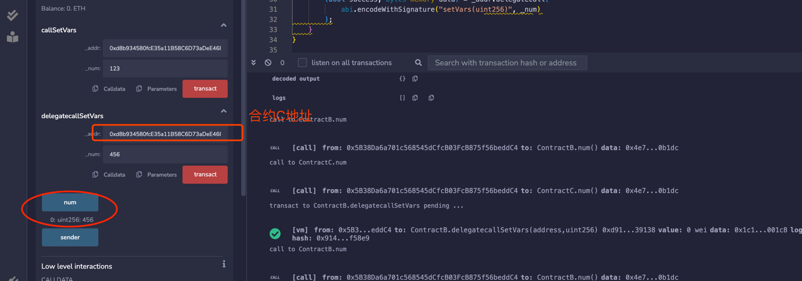

# 调用其他合约2

调用合约有2个官方函数Call 和 delegatecall。
call 是address类型的低级成员函数，它用来与其他合约交互。它的返回值为(bool, data)，分别对应call是否成功以及目标函数的返回值；
delegatecall与call类似，是solidity中地址类型的低级成员函数。
当用户A通过合约B来call合约C的时候，执行的是合约C的函数，语境(Context，可以理解为包含变量和状态的环境)
也是合约C的：msg.sender是B的地址，并且如果函数改变一些状态变量，产生的效果会作用于合约C的变量上。
而当用户A通过合约B来delegatecall合约C的时候，执行的是合约C的函数，但是语境仍是合约B的：msg.sender是A的地址，并且如果函数改变一些状态变量，产生的效果会作用于合约B的变量上。

# 1 准备两个合约B和C

首先，合约B必须和目标合约C的变量存储布局必须相同，两个变量，并且顺序为num和sender。

```solidity
contract B {
    uint public num;
    address public sender;
```

准备两个function，一个callSetVars，另一个delegatecallSetVars，分别通过call和delegatecall调用。

# 2 测试验证

编译部署得到两个合约。  


## 2.1 合约B通过call方法调用合约C

这里会改变合约c的变量值。  
  
执行成功后，查看合约C的变量值已经变了。  


## 2.2 合约B通过delegatecall方法调用合约C

这里**不会改变**合约C的变量值，而是改变合约B的变量值。  


# 小结

delegatecall与call类似，都可以用来调用其他合约；
不同点在于运行的语境，B call C，语境为C；而B delegatecall C，语境为B。目前delegatecall最大的应用是代理合约和EIP-2535
Diamonds（钻石）。
