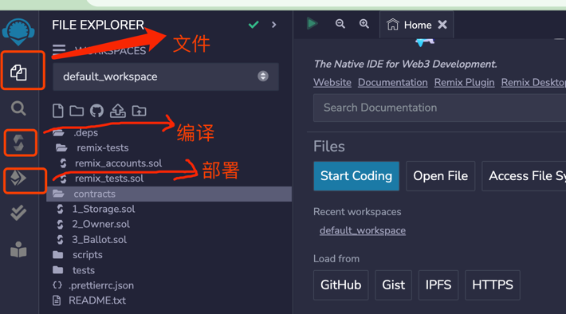
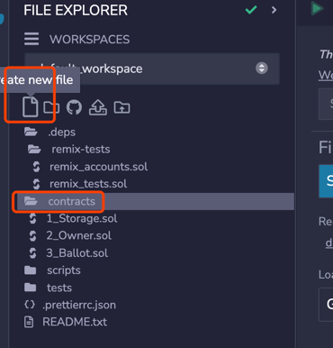
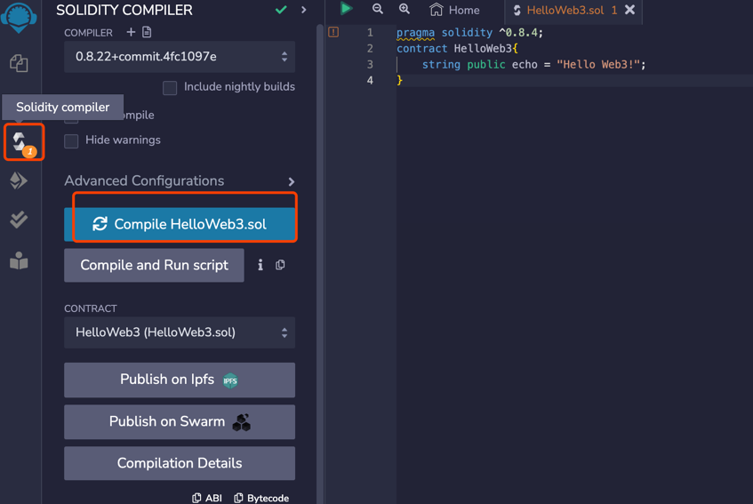
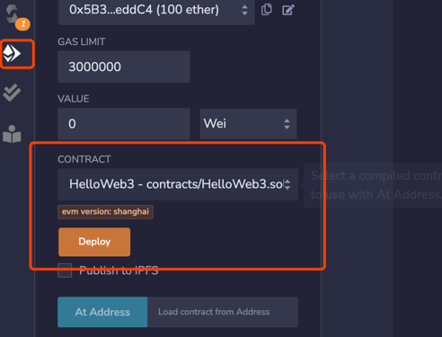
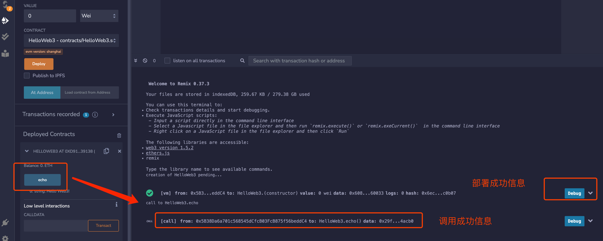

# 开发工具：remix基本使用

remix是以太坊官方推荐的智能合约开发IDE（集成开发环境），适合新手，可以在浏览器中快速部署测试智能合约，你不需要在本地安装任何程序。

网址：remix.ethereum.org

## 1 基础功能

进入remix，我们可以看到最左边的菜单有三个按钮，分别对应文件（写代码的地方），编译（跑代码），部署（部署到链上）。我们点新建（Create
New File）按钮，就可以创建一个空白的solidity合约。



## 2 新建合约 HelloWeb3.sol

选择文件夹，然后单击"create new file" 或者直接文件夹右击创建。



合约代码

```solidity
// SPDX-License-Identifier: MIT
pragma solidity ^0.8.4;

contract HelloWeb3 {
    string public echo = "Hello Web3!";
}
```

## 3 compile && deploy



编译成功后，单击 部署按钮，即可以看得到待部署合约。



部署成功后，即可看到public变量，右边栏是一些debug信息，
点击echo，显示他的value，且日志也有相关打印信息。



## 总结

至此，我们完成了基于remix的第一个智能合约程序。

